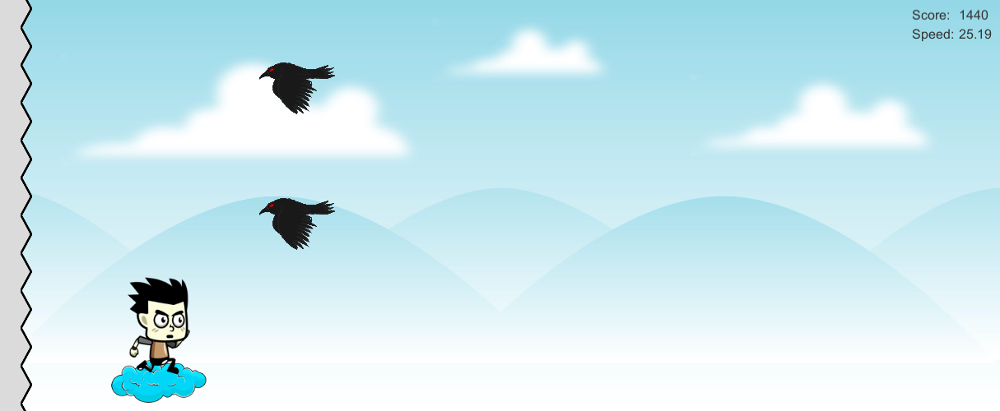

# Crazy Runner

这是一个 Unity3D 游戏，控制脚本使用 C# 编写。

游戏有两种模式，场景中包含了基本的游戏元素，感兴趣可以在此基础上进行扩展。

## 开始菜单

选择游戏模式，左侧为奔跑模式，右侧为飞行模式。

## 奔跑模式

玩家通过上键跳跃，左右键对角色施加水平方向的力。

玩家在地面上奔跑，空中会随机抛出木桶

玩家需要躲避木桶的袭击，若被木桶砸中，血量减一（半个气球）

玩家可通过红苹果来补充血量（一个气球）

地面会随机出现断崖，玩家需要跳过断崖，否则游戏结束

## 飞行模式

游戏场景被划分为上中下三部分，对应三个轨道，玩家可通过上下键来改变角色的垂直位置。

右侧会随机生成一到两只乌鸦，玩家需要躲避乌鸦的袭击。

若躲避成功，下次生成的乌鸦速度会提高，依次类推，直到速度上限。

若躲避失败，玩家会向左移动一段距离，同时下次生成的乌鸦速度会被重置。

如果玩家遭到多次躲避失败，被迫移动到最左侧，碰到锯齿，则游戏结束。

